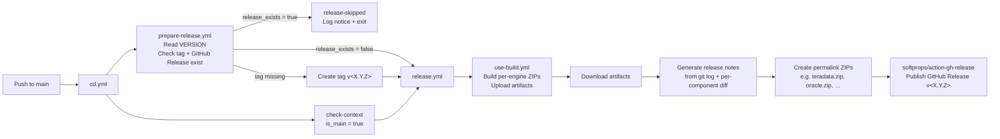

# Release Process

High-level overview of how a release of the **DDL Export Scripts** is produced and published.

## TL;DR

1. A contributor opens a PR that bumps `VERSION` (and any script changes).
2. While the PR is open → CI builds the per-engine ZIPs as artifacts (no tag, no release).
3. PR is merged into `main` → CD runs end-to-end: tag the version, build the ZIPs, generate release notes, publish a GitHub Release with both versioned and permalink ZIP assets.

## Components

```
.github/workflows/
├── cd.yml                       # Orchestrator (entry point on push to main / PR)
├── ci.yml                       # PR/branch build only (no release)
├── prepare-release.yml          # Reads VERSION, creates the git tag (main only)
├── release.yml                  # Builds + publishes GitHub Release with assets
├── publish-release.yml          # Manual: bump version + tag + release + open VERSION-bump PR (draft)
├── prerelease.yml               # Manual: build + publish a GitHub Pre-release (RC/beta/alpha)
├── use-build.yml                # Reusable: zips every engine folder
├── migrations-pr-draft.yml      # Adds/removes "DO NOT MERGE" label on draft PRs
└── migrations-pr-precommit.yml  # Validates pre-commit hooks ran (incl. VERSION bump)
```

## Triggers

| Event | Workflow that runs | What happens |
|---|---|---|
| `pull_request` (any branch, when changed files match `cd.yml` path filters) | `cd.yml` → `prepare-release.yml` + `ci.yml` | Version is read, ZIPs are built and uploaded as **artifacts**. **No tag, no release.** |
| `push` to `support/*`, `feature/*`, `bugfix/*`, `sfc-gh-*/*` | `ci.yml` | ZIPs built as artifacts. |
| `push` to `main` (merge of PR, when changed files match `cd.yml` path filters) | `cd.yml` → `prepare-release.yml` + `release.yml` | Tag is created, ZIPs are built, GitHub Release is published with notes and permalink assets. |
| `pull_request` lifecycle (draft toggles) | `migrations-pr-draft.yml` | Manages the `DO NOT MERGE` label. |
| `push` / `pull_request` | `migrations-pr-precommit.yml` | Re-runs pre-commit so a missed hook locally can't sneak past. |

> **Note:** `cd.yml` uses `paths` filters, so it does **not** run for every PR or every push to `main`. Changes limited to excluded paths — currently `README.md`, `VERSION`, `[ARCHIVED] TeradataScripts/**`, and `**/additional_notes/**` — will skip `cd.yml`.

## End-to-end flow on `main`



On a PR, step **C** still runs (read-only — it does not push a tag because `is_main != 'true'`) and step **E** is replaced by `ci.yml`, which only uploads ZIP artifacts.

The `release_exists` short-circuit makes the two release entry points orthogonal:

- **One-click via `publish-release.yml`** — that workflow publishes the release itself, then opens a `release/v<version>` bump PR. When the bump PR merges, `cd.yml` sees the release already exists and runs only `prepare-release.yml` + `release-skipped` (no rebuild, no re-upload).
- **Manual VERSION bump in a PR** — the legacy path. No prior release exists, so the short-circuit does not trigger and `cd.yml` runs the full build + publish.

## Versioning

- The single source of truth is the [`VERSION`](../../VERSION) file at repo root, e.g. `__version__ = "0.2.0"`.
- The pre-commit hook (`.github/hooks/`) enforces that `VERSION` is bumped whenever a `.sh` or `.sql` script changes. `migrations-pr-precommit.yml` is the CI safety net for the same rule.
- `prepare-release.yml` derives three forms of the version for its internal steps:
  - `VERSION_DOTS` → `0.2.0` (used in ZIP file names)
  - `VERSION_CLEAN` → `0.2.0` without any `v` prefix (used for the tag)
  - `VERSION` → `0_2_0` (underscored, for places that don't accept dots)
  `prepare-release.yml` exposes `version_clean`, `version_dots`, `tag_exists`, and `release_exists` as `workflow_call.outputs`, which `cd.yml` consumes to short-circuit a redundant build+publish cycle (see *End-to-end flow* below). `use-build.yml` separately exposes `version`, `version_dots`, and `version_clean`, which `release.yml` reads when wiring up download artifact paths.
- The tag is always `v<VERSION_CLEAN>` (e.g. `v0.2.0`). Legacy `vv*` tags are **not** auto-cleaned today: `release.yml` has a cleanup step but its current condition (`if: tag_exists != 'true'`) prevents it from running when a `vv*` tag actually exists. Tracked as a separate workflow bug to fix outside this docs change.

## Artifacts

`use-build.yml` packages each supported engine into its own ZIP and validates the directory exists first. Engines currently packaged:

`DB2`, `Hive`, `Netezza`, `Oracle`, `Redshift`, `SQLServer`, `Teradata`, `Vertica`, `BigQuery`, `Databricks`, `Synapse`, `Sybase IQ`, `Power BI`, `AlternativeSQLServerExtractionMethods`, `ETL/Informatica PowerCenter`.

Each engine produces **two** assets on the GitHub Release:

| Type | Example | Use case |
|---|---|---|
| Versioned | `teradata_v0.2.0.zip` | Reproducible download of a specific release. |
| Permalink | `teradata.zip` | Stable URL that always points to the latest release of that engine. |

Permalinks are generated by copying the versioned ZIP without the version suffix right before publishing the release.

## Release notes

`release.yml` auto-generates the body of each GitHub Release, including:

- Changelog (commits between previous tag and `HEAD`).
- Stats (changed files, commits, contributors).
- Per-component change list (only components with changes appear).
- Installation/usage instructions and a "Full Changelog" comparison link.

If a tag for the current `VERSION` already exists, the workflow falls back to a manually computed changelog instead of bailing out, so re-runs are idempotent.

## Adding a new engine

1. Add the engine folder at the repo root.
2. In `use-build.yml`:
   - Add the folder to the `Validate directory structure` step.
   - Add a `vimtor/action-zip@v1` step producing `<engine>_v${VERSION_DOTS}.zip`.
   - Add the new ZIP to `Verify ZIP files` and to the `Upload Zipped Files` artifact list.
3. In `release.yml`:
   - Add the engine to `Create permalink versions of ZIP files`.
   - Add both `<engine>_v${VERSION_DOTS}.zip` and `<engine>.zip` to `Upload All Release Assets`.
   - Add the engine to `add_component_changes` calls in `Generate release notes`.
4. Update `Included Components` in the release notes template inside `release.yml`.
5. Update the supported list in this doc and in the root [`README.md`](../../README.md).

## Cutting a release manually

There are two supported paths for cutting a stable release. Pick whichever fits.

### Recommended: one-click via `publish-release.yml`

For most releases, just run the manual workflow and let it do everything.

1. Go to **Actions → Publish Release → Run workflow**.
2. Fill the inputs:
   - **`version`** (required): stable semver `X.Y.Z`, e.g. `0.3.0`. The workflow rejects pre-release suffixes — for those, use the **Pre-release** workflow.
   - **`ref`** (default `main`): branch / tag / SHA to base the release on.
   - **`draft_release`** (default `false`): publish the GitHub Release as draft so you can sanity-check before going public.
3. Click **Run workflow**.

What it does, in order:

1. **Validates** the version is `X.Y.Z` and that `v<version>` doesn't already exist (tag and `release/v<version>` branch).
2. **Builds** the per-engine ZIPs at the chosen `ref` via `use-build.yml`, passing `version_override` so the ZIPs are stamped with the requested version regardless of the current `VERSION` file.
3. **Tags** the chosen `ref` as `v<version>` and **publishes** the GitHub Release (versioned ZIPs + permalinks + auto-generated notes). At this point the release is live.
4. **Opens a draft PR** on a new branch `release/v<version>` that bumps `VERSION` and runs `VERSION-UPDATE.sh` to propagate the version into every engine's `.py` / `.sh` / `.ps1` / `.bat`. Review and merge to persist the bump on `main`.

When that draft PR is merged, `cd.yml` re-runs on `main`. `prepare-release.yml` checks whether a published GitHub Release for `v<version>` already exists; if so, `cd.yml` **skips** the build+publish jobs entirely and emits a `release-skipped` notice in the run summary. Net cost: one cheap `prepare-release` job (~10 s), no duplicate ZIP rebuild, no duplicate asset upload.

If you ever need to **regenerate** the assets for an already-published version (e.g. recovering from a bad build), delete the GitHub Release on the Releases page and re-run `cd.yml` from the Actions tab — with the release gone, the short-circuit no longer fires and the full build+publish path runs.

### Manual fallback: VERSION bump in a PR

If you'd rather drive the release through a standard PR review:

1. Open a PR that bumps `VERSION` (and runs `./VERSION-UPDATE.sh` locally so engine scripts match).
2. Wait for CI green and review.
3. Merge into `main`.
4. The `CD` workflow tags `v<X.Y.Z>` and publishes the GitHub Release automatically.

If a release ever needs to be re-run (e.g. asset upload failed), re-run the `CD` workflow from the Actions tab — `release.yml` is idempotent against existing tags.

## Cutting a pre-release (RC / beta / alpha)

When you want to ship a build for QA / external validation **without** bumping the official `VERSION` or touching `main`, use the manual `prerelease.yml` workflow.

1. Go to **Actions → Pre-release → Run workflow**.
2. Fill the inputs:
   - **`version`** (required): semver pre-release suffix is mandatory, e.g. `0.3.0-rc.1`, `0.3.0-beta.2`, `0.3.0-alpha.1`. The workflow validates this with a regex and rejects bad inputs.
   - **`ref`** (default `main`): branch, tag, or SHA to build from. Useful to pre-release a `feature/*` before merging.
   - **`draft`** (default `false`): publish as a draft so you can sanity-check the assets before going public.
3. Click **Run workflow**.

What it does:

- Builds the per-engine ZIPs at the chosen ref via `use-build.yml` (passing `version_override`, so the version comes from the dispatch input — no need to change `VERSION`).
- Refuses to run if `v<version>` already exists.
- Creates the annotated git tag `v<version>` on the chosen ref.
- Publishes a GitHub Release marked **`prerelease: true`** with auto-generated notes and the 14 versioned ZIP assets.
- **Does not** create permalink ZIPs (e.g. `teradata.zip`). Permalinks remain pinned to the latest **stable** release so consumers that pin to "latest" are not surprised by an RC.

Recommended flow when working towards a `0.3.0` release:

```
1. Dispatch Pre-release with version=0.3.0-rc.1
   → publishes v0.3.0-rc.1 as prerelease for QA
2. QA validates the ZIPs of the RC
3. If issues are found, fix on a branch and dispatch 0.3.0-rc.2 (etc.)
4. When the RC is approved: open a PR that bumps VERSION to 0.3.0 + runs ./VERSION-UPDATE.sh
5. Merge to main → CD publishes v0.3.0 as the stable release
```

## Troubleshooting

| Symptom | Likely cause | Fix |
|---|---|---|
| Pipeline fails on `Validate directory structure` | A required engine folder was renamed/removed. | Restore the folder, or update the validation list in `use-build.yml`. |
| Two tags exist (`v0.2.0` and `vv0.2.0`) | Legacy double-prefix bug. | `release.yml` removes the `vv*` tag automatically on the next main run. |
| Release notes lack a component section | Nothing changed in that component since the previous tag. | Expected — only changed components are listed. |
| `migrations-pr-precommit` fails on a PR | `VERSION` wasn't bumped after editing scripts. | Run `./.github/scripts/install-hooks.sh` locally and bump `VERSION`. |

## See also

- [`WORKFLOWS.md`](./WORKFLOWS.md) — full index of every workflow.
- Root [`README.md`](../../README.md) — user-facing docs and supported engines.
- [`VERSION`](../../VERSION) — the version source of truth.
