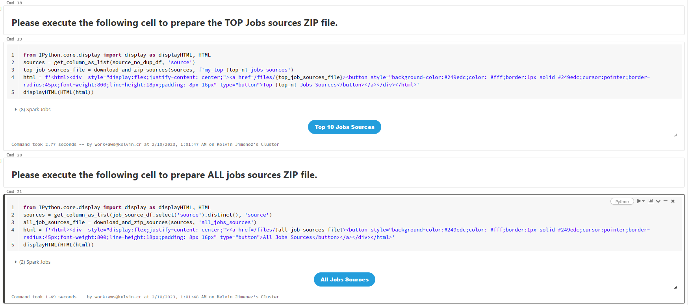

# DataBricks Export Scripts

This repository provides some simple scripts to help exporting your Databricks code.

There are several ways to extract your code from DataBricks. We will provide several alternatives. Choose the one that works better in your scenario.

## Version
0.0.95

## Extracting with the DBX Command Line Tool

The Databricks command line tool can be used in order to export your application code.
1. Open a terminal.
1. Install the databricks command line tool. Follow the instructions in the [documentation](https://docs.databricks.com/dev-tools/cli/index.html). In most cases just running `pip install databricks-cli` should be enough.
2. From the terminal, setup a pair of environment variables:
It should be something like this:
```
$ export DATABRICKS_HOST=https://*************.azuredatabricks.net/
$ export DATABRICKS_TOKEN=************************************
```
Adjust those variables to point to your databricks account.
3. You can then run:
```
databricks workspace list
```
that will show a listing like:
```
Users
Shared
Repos
```
4. Export a workspace. For example to export all the `Shared` workspace you can run:
```
$ databricks workspace export_dir "/Shared" "~/exportSharedWorkspace" -o
```
5. Zip the folder.
```
zip -r exportedWorkspace.zip ~/exportSharedWorkspace
```

## Extracting with a DBX Notebook

This is another alternative to extract your source code, it provides two choices of ZIP file with source codes either notebooks or python source in your repo or DBFS. The first one includes only sources from the top time-consuming jobs and the second includes all the source files from the running jobs. That means interactive notebooks, not scheduled to run, won't be exported.

1. Open your Databricks workspace and creates an new notebook.
2. Open File menu and click import.
3. Select URL and paste ***https://github.com/Snowflake-Labs/SC.DDLExportScripts/blob/main/Databricks/Download_jobs_sources.dbc***
4. Follow notebook instructions.
   1. Install Databricks pypi dependency.
   2. Update configuration accordling with your cluster (host_url, and token). ***We Advise against using the token directly in the notebook. Please store it in a secret scope, using Databricks CLI***.  For more details [Databricks Authentication](https://docs.databricks.com/dev-tools/api/latest/authentication.html)

 

## Reporting issues and feedback

If you encounter any bugs with the tool please file an issue in the
[Issues](https://github.com/Snowflake-Labs/SC.DDLExportScripts/issues) section of our GitHub repo.

## License

These scripts are licensed under the [MIT license](https://github.com/Snowflake-Labs/SC.DDLExportScripts/blob/main/Databricks/License.txt).
