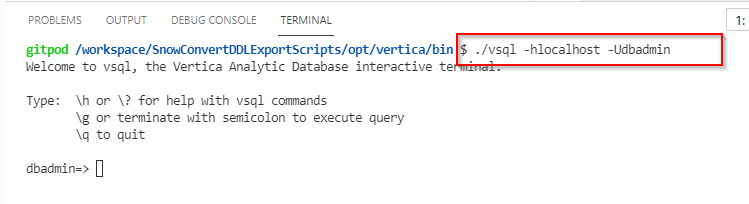
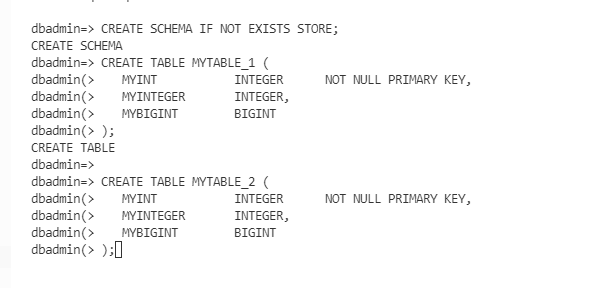
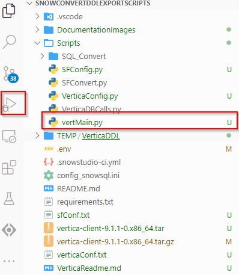
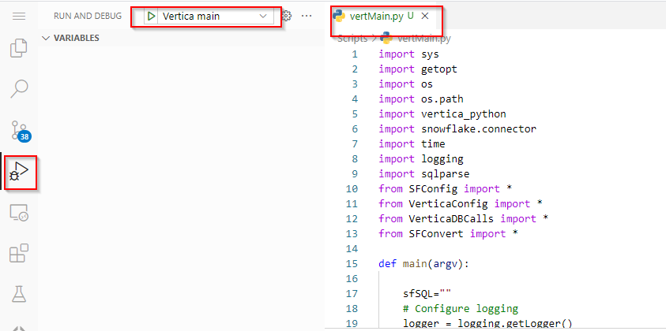

# Vertica DDL Migration Utility

## Overview

In the absence of a third party tool to perform migration of Vertica DDL to snowflake.

## Repository Structure

This repository has the following structure:

+ Project Folder
  + .vscode
  + opt/vertica
    + bin
      + vsql
      + vsql32
  + DocumentationImages
  + Scripts
  + TEMP 
    

## 1 Vertica To Snowflake DDL Migration

In the absence of a third party tool to perform migration of Vertica SQL to snowflake, this utility can be used by snowflake employees who are involved in such a project.

    ●	Configuration
    ●	Execution

### Configuration

#### Python dependencies are:

●	Vertica Python Connector
●	Pandas
●	sqlparse

```
    To install do pip install -r requirements.txt
```

#### Python scripts 

The scripts can be located at ./Scripts Included with the scripts is a sample configuration file. The next section describes the config file.


The python scripts are :-

      ●	vertMain.py		This is the script that is called from the command line
      ●	SFConfig.py		Class file for SF configuration
      ●	VerticaConfig.py	Class file for Vertica configuration
      ●	VerticaDBCalls.py	Class file containing Vertica DB methods
      ●	SFConvert.py		Class file containing the DDL migration and Snowflake DB methods

Sample configuration files:-

      ●	sfConf.txt		Details on snowflake config
      ●	verticaConf.txt		Details on vertica config.

#### Vertica Config

The following file is an example of the Vertica file.(Example: ./verticaConf.txt)

```
[vertica]
host=localhost
port=5433
user=dbadmin
database=docker
ssl=False
schema=store
```

#### Snowflake Config 

The following is an example of the Snowflake file.(Example: ./sfConf.txt)


```
[snowflake]
account=xxxxxx
user=xxxxxxx
password=XXXXXXXXXXXXX
role=verticadb_role
# schema_mappings map the vertica schema to the sf schema
# Format 
#    vertica_schema=snowflake_db.snowflake_schema
[schema_mappings]
store=store
[inview_mappings]
store=store
# This section determines what to do with the DDL
# Valid options are
#    ddlDisplay=[True|False]   If True, the DDL is written to the log 
#    ddlSave=<folder>          If present, write the ddl into <folder>
#    ddlExecute=[True|False]   If True, executes the ddl in snowflake.  If not present ddlExeute will be false
#    dropExisting=[True|False] If True, existing table will be dropped. 
#                              If False, the table will not be dropped but a warning will be given saying the table exists
#    processViews=[True|False] If True, migrate the views from the vertica instance to snowflake.
#                                 be sure to utilise [inview_mappings] to ensure the view will compile ok
#                              If false, the views will not be migrated.
[execution]
ddlDisplay=True
ddlSave=TEMP/VerticaDDL
ddlExecute=True
dropExisting=False
processViews=True
```

#### Create the TEMP\VerticaDDL folder.

Create the folder ./TEMP/VerticaDDL in the project.


#### Update the file launch.json

Update the file ./vscode/launch.json add the following code


```
        {
            "name": "Vertica main",
            "type": "python",
            "request": "launch",
            "program": "${file}",
            "console": "integratedTerminal",
            "justMyCode": false,
            "envFile": "${workspaceFolder}/.env",
            "args": ["-s","/workspace/SnowConvertDDLExportScripts/sfConf.txt","-v","/workspace/SnowConvertDDLExportScripts/verticaConf.txt"]
        }
```


#### Run the script to set all the environment variables. 

Run the following script in the command line

```
    export $(xargs < .env)
```

####  Add Docker extension into the project 


####  Install the vertica client divers 

Follow the steps below or just run the following command in the terminal.

```
    ./install-vertica.sh
```


Download the driver for linux 9.1.x 

https://www.vertica.com/client-drivers/


    Once the tar file is downloaded copy the file and paste it in the root directory of the project.


#### Unzip the file 

```
    gzip -d vertica-client-9.1.1-0.x86_64.tar.gz
```

#### Untar the file 
```
    tar -xvf vertica-client-9.1.1-0.x86_64.tar
```

Once the gz file was unzip right click in the directory ./opt/vertica/bin created and run a new terminal.


#### Connect to the server

Run the following command to connect to the server.
        
```
        docker run -p 5433:5433  dataplatform/docker-vertica
```


#### Confirm the server is running

    Confirm the docket container is running


#### Connect to the database

Run the following command in the new terminal to connect to the database.

```
        ./vsql -hlocalhost -Udbadmin
```



#### Create the schema

Run the following command to create the schema(Example).

```
 CREATE SCHEMA IF NOT EXISTS STORE;
```

#### Create tables 

Run the following command to create the tables(Example).


```
CREATE OR REPLACE TABLE STORE.MYTABLE_1 (
   MYINT           INTEGER      NOT NULL PRIMARY KEY,
   MYINTEGER       INTEGER,
   MYBIGINT        BIGINT
);

CREATE OR REPLACE TABLE STORE.MYTABLE_2 (
   MYINT           INTEGER      NOT NULL PRIMARY KEY,
   MYINTEGER       INTEGER,
   MYBIGINT        BIGINT
);
```



#### Create views 

Run the following command to create the views(Example).

```
SELECT MYINT,
       MYINTEGER,
       MYBIGINT
FROM STORE.MYTABLE_1;

CREATE OR REPLACE VIEW STORE.MYVIEW2 AS
SELECT MYINT,
       MYINTEGER,
       MYBIGINT
FROM STORE.MYTABLE_2;
```


### Execution

Run the python script ./Scripts/vertMain.py



Debug the code



### Run sucessfully 

Once the project run sucessfully the project created the sql scripts in the folder created previously ./TEMP/VerticaDLL

Example 
```
Create or Replace View store.MYVIEW2 AS
SELECT MYTABLE_2.MYINT,
       MYTABLE_2.MYINTEGER,
       MYTABLE_2.MYBIGINT
FROM store.MYTABLE_2
```


  


